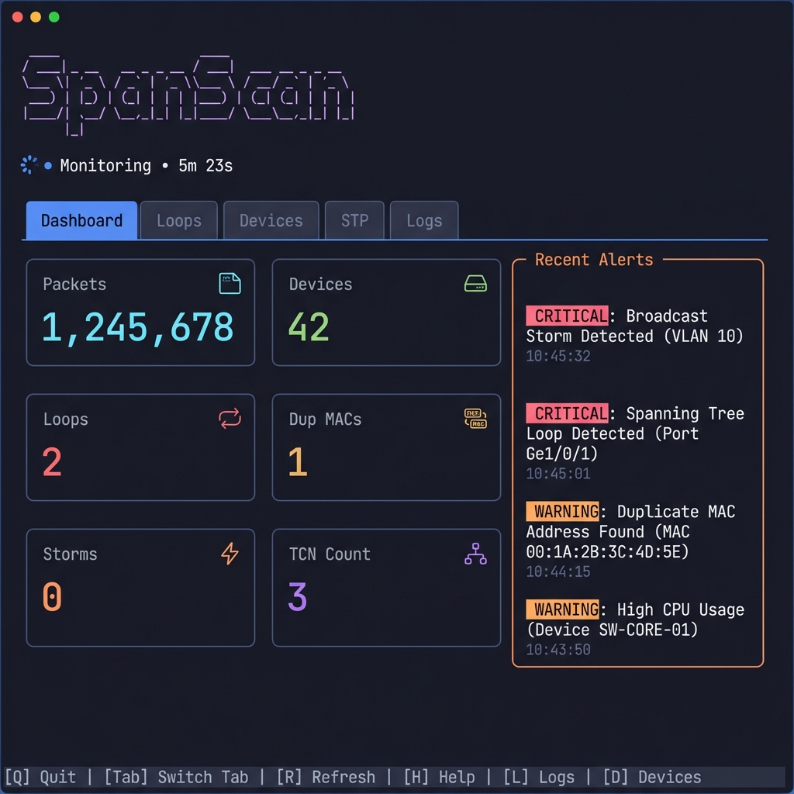

# SpanScan

**A Network Loop & STP Issue Detector with Modern TUI (SNMP Edition)**

SpanScan is a real-time network monitoring tool designed to detect Layer 2 network loops, broadcast storms, and Spanning Tree Protocol (STP) misconfigurations. Unlike passive packet capture tools, **SpanScan uses active SNMP polling** to gather data directly from network switches, providing a comprehensive view of the network state without requiring promiscuous mode or direct connection to the loop.



---

## Table of Contents

- [How It Works](#how-it-works)
- [Features](#features)
- [Supported Vendors](#supported-vendors)
- [Installation](#installation)
- [Configuration](#configuration)
- [Usage](#usage)
- [Troubleshooting](#troubleshooting)

---

## How It Works

SpanScan connects to your network switches via SNMP (v1, v2c, or v3) and polls key metrics to identify anomalies:

1.  **Broadcast Storm Detection**: Monitors interface packet rates (`ifInNUcastPkts`). If broadcast traffic exceeds a threshold, it flags a storm.
2.  **MAC Flapping / Loop Detection**: Polls the MAC Address Table (`dot1dTpFdbTable`). If the same MAC address appears on multiple interfaces or moves between switches rapidly, it indicates a loop.
3.  **VLAN Awareness**: For supported vendors (like Cisco), SpanScan iterates through all active VLANs to build a complete picture of the network, detecting loops that might only exist in specific VLANs.

---

## Features

-   **Active SNMP Monitoring**: No need for SPAN ports or promiscuous mode.
-   **Multi-Vendor Support**: Auto-detects and applies templates for major switch brands.
-   **Advanced SNMP Support**: 
    -   Versions: v1, v2c, v3 (AuthPriv/AuthNoPriv/NoAuthNoPriv).
    -   VLAN-aware polling (Community Indexing for Cisco).
-   **Modern TUI**: Beautiful terminal interface built with [Charm](https://charm.sh/).
    -   **Real-time Dashboard**: Visual cards for stats and alerts.
    -   **Settings Tab**: Configure SNMP targets directly in the UI.
    -   **Device Tracking**: See where every MAC address is located.
-   **JSON Logging**: Structured logs for integration with SIEM or other tools.

---

## Supported Vendors

SpanScan includes specific templates to handle vendor idiosyncrasies (like how they expose MAC tables):

| Vendor | Strategies Used | Notes |
| :--- | :--- | :--- |
| **Cisco** (IOS/NX-OS) | Community Indexing | Polls per-VLAN using `community@vlan_id` |
| **Juniper** | Q-BRIDGE-MIB | Uses standard Q-Bridge MIBs |
| **HP / Aruba** | Q-BRIDGE-MIB | Uses standard Q-Bridge MIBs |
| **Arista** | Standard | Standard MIB-II / BRIDGE-MIB |
| **Ubiquiti** | Standard | Standard MIB-II |
| **Generic** | Standard | Fallback for any SNMP-enabled device |

---

## Installation

### Prerequisites

-   **Go 1.21+** (to build from source)
-   Network access to your switches (UDP port 161)
-   SNMP Read-Only credentials

### Build

```bash
git clone https://github.com/yourusername/spanscan.git
cd spanscan
go build -o spanscan
```

---

## Configuration

You can configure SpanScan via command-line flags, a JSON config file, or the **TUI Settings** tab.

### JSON Configuration (`config.json`)

```json
{
  "pollIntervalSec": 10,
  "broadcastStormThreshold": 500,
  "targets": [
    {
      "address": "192.168.1.10",
      "version": "v2c",
      "community": "public"
    },
    {
      "address": "10.0.0.5",
      "version": "v3",
      "username": "admin",
      "securityLevel": "AuthPriv",
      "authProto": "SHA",
      "authPass": "secret123",
      "privProto": "AES",
      "privPass": "privacy456"
    }
  ]
}
```

### Command Line Flags

```bash
# Quick start with v2c targets
./spanscan --targets=192.168.1.10,192.168.1.11 --community=public

# Load from config file
./spanscan --config=my_network.json

# Tuning
./spanscan --poll-interval=5 --broadcast-threshold=1000
```

---

## Usage

### TUI Navigation

| Key | Action |
| :--- | :--- |
| `s` | **Start** polling |
| `p` | **Pause** polling |
| `q` | **Quit** application |
| `Tab` / `Shift+Tab` | Switch Tabs |
| `1-6` | Jump to specific Tab (Dashboard, Loops, Devices, STP, Settings, Logs) |
| `Enter` | (In Settings) Add Target |

### Adding Targets in TUI

1.  Navigate to the **Settings** tab (`5` or `Tab`).
2.  Enter the IP address.
3.  Select Version (v1, v2c, v3).
4.  Fill in credentials (Community for v1/v2c; User/Pass for v3).
5.  Press **Enter** to add.
6.  Press **s** to start monitoring if not already running.

---

## Troubleshooting

### "Error connecting to SNMP target"
-   Verify IP reachability (`ping`).
-   Verify SNMP is enabled on the switch and the community string/credentials are correct.
-   Check firewall rules allowing UDP 161.

### "No Devices Detected"
-   Ensure you are using the correct SNMP version.
-   For Cisco, ensure the user/community has permission to access VLAN contexts.

### "Unknown Vendor"
-   SpanScan will default to "Generic". If detection fails, ensure the device supports standard MIB-II (`sysDescr`).

---

## License

MIT License